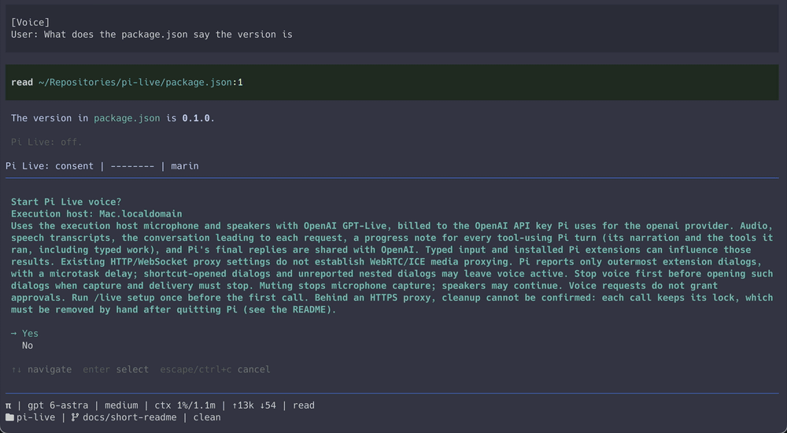

# pi-live

Talk with [Pi](https://github.com/earendil-works/pi), the terminal coding
agent. Not dictation: Pi Live runs on a speech-to-speech model, so you have a
conversation. You ask, Pi works with its usual tools, voice tells you what it
is doing, you interrupt or follow up, and the result comes back spoken. Typed
and spoken input share one conversation, and you keep the terminal.



## Three ways to use it

- **Talk with Pi while it codes.** `/live`, then speak. "Rename this module
  and fix the imports" becomes an ordinary Pi request. While it runs, ask
  what Pi is doing and hear the answer; when it finishes, hear the summary.
  Keep typing in between.
- **Drive the web by voice.** `/live browser` adds a browser. Quick steps
  ("open Hacker News", "click the third link", "scroll") run at once; bigger
  jobs ("compare these two listings", "fill in the form") go to Pi with a
  `live_browser` tool. [Jev](https://typesafe.ai) decides which is which.
- **Use Codex voice if you would rather not pay for API usage.** Codex has
  voice on a ChatGPT subscription. Pi Live's MCP server gives it the same
  browser tool, so the web part works by voice with no API bill and no Pi.
  In the author's experience Pi's browser mode is the faster of the two.

## Before you start

- **macOS arm64 only.** Checked with Node 22.19+, Pi 0.87.1 and the
  `@oh-my-pi/pi-natives-darwin-arm64` audio package, which exists only for
  that platform.
- **Pi voice costs money.** It runs on OpenAI's GPT-Live API, billed to the
  OpenAI key Pi already uses. The Codex route adds nothing to your bill.
- **Audio and context leave your machine.** Speech, transcripts, the
  conversation around each request and Pi's replies go to OpenAI. In browser
  mode, each request and the current page title also go to TypeSafe for
  routing. Pi Live asks for consent on every call.
- **Experimental.** In personal use by its author on one laptop. Issues and
  pull requests are welcome; there is no support commitment.

## Install

```sh
git clone https://github.com/skhlo/pi-live && cd pi-live
pnpm install --frozen-lockfile --ignore-scripts --config.auto-install-peers=false --config.enable-global-virtual-store=false
pi            # trust the project; Pi loads the extension from .pi/settings.json
```

Then, inside Pi:

```
/live setup   # once: prepares ~/.local/state/pi-live
/live         # start; macOS asks for microphone access the first time
/live stop    # hang up; Pi keeps working on anything already handed over
```

Pi needs an OpenAI API key for its `openai` provider. From any other folder,
load the extension with `pi -e /path/to/pi-live/index.ts`.

Browser mode needs Chrome, a checkout of
[jev-voice-browser](https://github.com/moritzkremb/jev-voice-browser) and a
TypeSafe key; see [browser mode](docs/browser-mode.md). The Codex route needs
only Chrome; see [Codex browser server](docs/codex-browser-server.md).

## Learn more

- [Using Pi Live](docs/usage.md): every `/live` form, the widget, mute,
  voices, what happens while Pi works.
- [Data sharing and consent](docs/privacy.md): exactly what is shared, with
  whom, and the dialog cases that can leave voice active.
- [Recovery](docs/recovery.md): failure codes, the stuck-lock procedure,
  going back.
- [Development](docs/development.md): the pinned pnpm policy, checks, CI,
  and the [design notes](docs/DESIGN.md).

## Credits and license

MIT. Adapted from
[monotykamary/pi-better-openai](https://github.com/monotykamary/pi-better-openai)
(original work by Matt Leong), with portions from `can1357/oh-my-pi`.
[PROVENANCE.md](PROVENANCE.md) and
[THIRD_PARTY_NOTICES.md](THIRD_PARTY_NOTICES.md) carry the pins, hashes and
attributions. They are diligence, not legal clearance.
